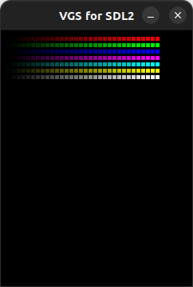
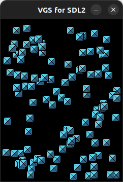
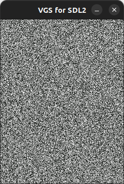
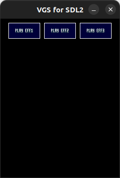
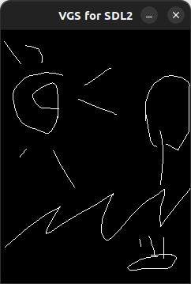

# vgssdk-pico examples

## Examples

|Directory|Screenshot|Description|
|:-|:-|:-|
|[./vdp/vdp_test.cpp](./vdp/vdp_test.cpp)||VDPの使用例|
|[./rgb/rgb.cpp](./rgb/rgb.cpp)||画面にRGBカラー等を表示|
|[./image/image.cpp](./image/image.cpp)||16x16のイメージをランダムに描画|
|[./sandstorm/sandstorm.cpp](./sandstorm/sandstorm.cpp)||砂嵐|
|[./sound/sound.cpp](./sound/sound.cpp)||BGMと効果音を再生|
|[./touch/touch.cpp](./touch/touch.cpp)||タッチで描画する簡易ペイント|

## How to Build

### macOS

XCODE と HomeBrew がインストールされた環境のターミナルで以下のコマンドを実行することでビルドと実行ができます。

```bash
# SDL2 をインストール
brew install sdl2

# リポジトリを取得
git clone https://github.com/suzukiplan/vgssdk-pico

# リポジトリのディレクトリへ移動
cd vgssdk-pico

# ビルド
make

# 実行
./bin/rgb
```

### Linux

```bash
# SDL2 をインストール
sudo apt-get install libsdl2-dev

# ALSA をインストール
sudo apt-get install libasound2
sudo apt-get install libasound2-dev

# リポジトリを取得
git clone https://github.com/suzukiplan/vgssdk-pico

# リポジトリのディレクトリへ移動
cd vgssdk-pico

# ビルド
make

# 実行
./bin/rgb
```

### 東方VGS実機版

1. [PlatformIO Core](https://docs.platformio.org/en/latest/core/installation/index.html) をインストール
2. [東方VGS実機版](https://github.com/suzukiplan/tohovgs-pico) (RaspberryPi Pico) の BOOTSEL ボタンを押しながら PC と USB ケーブルで接続
3. [../pico/](../pico/) ディレクトリ以下にある実行したい example のディレクトリ以下で `make` コマンドを実行

```bash
git clone https://github.com/suzukiplan/vgssdk-pico
cd vgssdk-pico/pico/rgb
make
```
